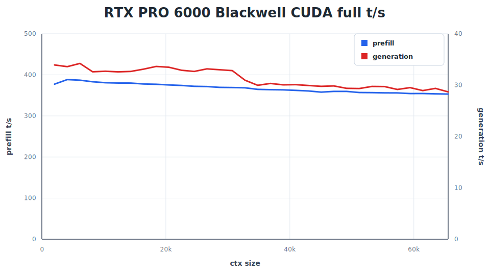
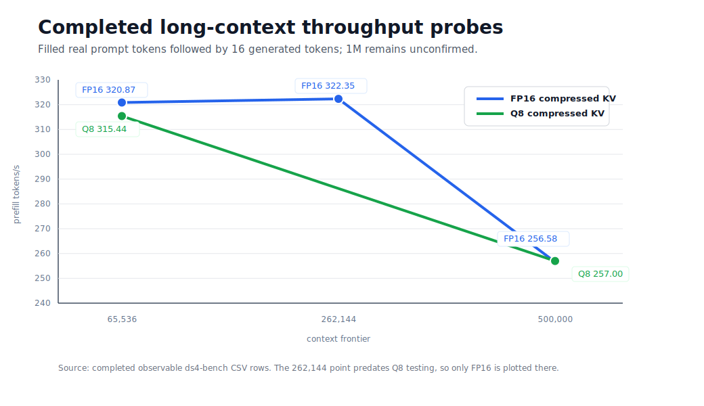
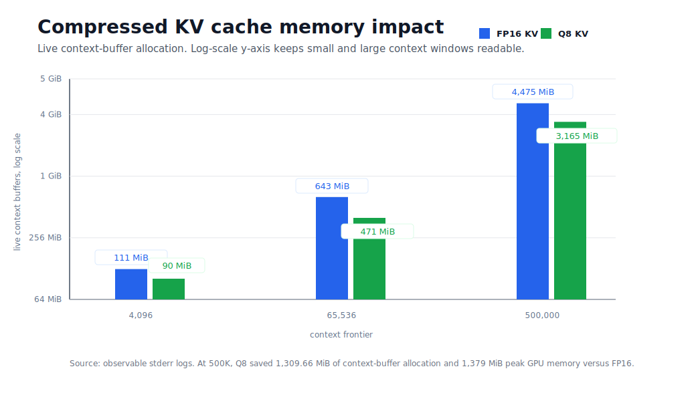

# ds4-win-NovaStar

Native Windows CUDA port and benchmark report for
[antirez/ds4](https://github.com/antirez/ds4), the DwarfStar inference engine
for DeepSeek V4 Flash.

This windows port confirmed 0.5M context window run on single RTX PRO 6000 GPU at 15.5 t/s generation and 257 t/s prefill. Benchmark details below.

## Acknowledgement

The original DwarfStar / ds4 project was created by Salvatore Sanfilippo
(`antirez`) and the ds4.c authors. It is a focused inference engine for
DeepSeek V4 Flash and DeepSeek V4 PRO, with custom GGUF loading, model-specific
CUDA/Metal/ROCm execution paths, compressed KV-cache handling, benchmark tools,
and local-serving/agent infrastructure.

This repository is an independent Windows CUDA port. It preserves the upstream
MIT license and GGML acknowledgement. It is not affiliated with, sponsored by,
or endorsed by the upstream authors.

## What This Windows Port Adds

- Native Windows builds for `ds4.exe`, `ds4-bench.exe`, `ds4-server.exe`, and
  `ds4-agent.exe` using MSVC and NVCC.
- A Win32 compatibility layer for the POSIX APIs used by the CLI, benchmark,
  server, and agent paths, including thread synchronization, memory mapping,
  large-file stat, positional reads, temp files, sockets, randomness, timing
  calls, and UTF-8 console setup.
- Correct large-GGUF support for the 86,720,111,488-byte DeepSeek V4 Flash
  IQ2XXS model file.
- Atomic Windows `pread` behavior using `ReadFile` with explicit offsets, so
  concurrent model reads do not disturb a shared file pointer.
- PowerShell build, run, and benchmark helpers for native Windows users.
- CUDA full-residency execution when enough VRAM is available.
- CUDA SSD expert streaming fallback when the full model cannot stay resident.
- Runtime-selectable compressed-attention KV storage:
  - `FP16` compressed KV, the Windows default.
  - `Q8` compressed KV via `DS4_CUDA_ATTN_COMP_CACHE=q8`.
- Native Windows server startup and OpenAI-compatible model-list smoke testing.
- Native Windows agent basic-console mode with file-read tool smoke testing.
- Completed 500,000-token real-prompt throughput probes with both FP16 and Q8
  compressed KV, followed by generation after the filled context.

The 500K run is the main Windows-port milestone in this branch: the model was
loaded natively on Windows, filled 500,000 real prompt tokens, and generated
after that frontier on a single RTX PRO 6000 Blackwell workstation.

## Current Windows Scope

Verified on native Windows in this branch:

- `ds4.exe --cuda`
- `ds4.exe --cuda --inspect`
- `ds4-bench.exe --cuda`
- `ds4-server.exe --cuda` startup and `/v1/models` smoke test
- `ds4-agent.exe --cuda` basic-console startup and file-read tool smoke test
- CPU compile/smoke builds for the main binaries
- Full CUDA residency
- SSD expert streaming fallback
- FP16 and Q8 compressed-attention KV cache modes

Known Windows limitations:

- The Windows agent currently uses a basic console loop rather than the full
  POSIX-style linenoise interface. Browser automation and shell job tools are
  limited in this build.
- The Windows server has been build/startup smoke-tested, but broad API and
  multi-client compatibility should be tested before production use.
- Distributed inference, eval tooling, GGUF generation tooling, and several
  quality/imatrix tools remain POSIX-oriented or unverified on native Windows.

## Install And Build On Windows

Prerequisites:

- Windows 11 or Windows Server
- Visual Studio Build Tools with the C++ workload
- NVIDIA CUDA Toolkit
- Recent NVIDIA driver
- A supported DeepSeek V4 Flash GGUF model file placed under `.\gguf\`

Build the CUDA binaries:

```powershell
powershell -ExecutionPolicy Bypass -File .\windows_build.ps1 -Target cuda
```

Build the CPU binaries:

```powershell
powershell -ExecutionPolicy Bypass -File .\windows_build.ps1 -Target cpu
```

Inspect the model:

```powershell
.\ds4.exe --cuda --inspect `
  -m .\gguf\DeepSeek-V4-Flash-IQ2XXS-w2Q2K-AProjQ8-SExpQ8-OutQ8-chat-v2-imatrix.gguf
```

Run a normal full-residency CUDA prompt:

```powershell
.\ds4.exe --cuda `
  -m .\gguf\DeepSeek-V4-Flash-IQ2XXS-w2Q2K-AProjQ8-SExpQ8-OutQ8-chat-v2-imatrix.gguf `
  --ctx 8192 --nothink --temp 0 -n 256 `
  -p "Write a short story about a small starship discovering a quiet signal."
```

Run with Q8 compressed KV:

```powershell
$env:DS4_CUDA_ATTN_COMP_CACHE = "q8"
.\ds4.exe --cuda `
  -m .\gguf\DeepSeek-V4-Flash-IQ2XXS-w2Q2K-AProjQ8-SExpQ8-OutQ8-chat-v2-imatrix.gguf `
  --ctx 8192 --nothink --temp 0 -n 256 `
  -p "Say hello in one sentence."
```

Run SSD expert streaming fallback:

```powershell
powershell -ExecutionPolicy Bypass -File .\windows_run.ps1 `
  -Ctx 8192 -Cache 8GB -Tokens 128 `
  -Prompt "Say hello in one sentence."
```

Start the local server:

```powershell
.\ds4-server.exe --cuda `
  -m .\gguf\DeepSeek-V4-Flash-IQ2XXS-w2Q2K-AProjQ8-SExpQ8-OutQ8-chat-v2-imatrix.gguf `
  --ctx 8192 --tokens 256
```

Smoke-test the server from another PowerShell window:

```powershell
Invoke-RestMethod http://127.0.0.1:8080/v1/models
```

Start the coding agent in Windows basic-console mode:

```powershell
.\ds4-agent.exe --cuda --ctx 32768 --tokens 2048 --nothink `
  --chdir (Get-Location).Path `
  -m .\gguf\DeepSeek-V4-Flash-IQ2XXS-w2Q2K-AProjQ8-SExpQ8-OutQ8-chat-v2-imatrix.gguf
```

For code review, ask the agent to search first and read targeted ranges rather
than reading large source files end-to-end.

Run the standard speed benchmark:

```powershell
powershell -ExecutionPolicy Bypass -File .\windows_benchmark.ps1 `
  -CtxStart 2048 -CtxMax 65536 -StepIncr 2048 -GenTokens 128
```

## Benchmark System

Only hardware relevant to reproducing the benchmark is listed.

| Component         | Specification                                            |
| ----------------- | -------------------------------------------------------- |
| GPU               | NVIDIA RTX PRO 6000 Blackwell Workstation Edition        |
| Driver            | 596.36                                                   |
| Reported VRAM     | 97,887 MiB via `nvidia-smi`                              |
| CPU               | AMD Ryzen 9 9950X3D, 16 cores / 32 threads               |
| System memory     | 128 GiB class, 134,911,172,608 bytes reported by Windows |
| SSD               | Samsung SSD 9100 PRO 2TB NVMe                            |
| CUDA Toolkit      | 13.2                                                     |
| OS                | Native Windows                                           |
| Model             | DeepSeek V4 Flash IQ2XXS GGUF                            |
| Model tensor span | 80.76 GiB                                                |

## Standard Benchmark Results

This table compares the Windows run against the existing `speed-bench` reference
entries included with the upstream ds4 benchmark data. The non-Windows rows are
not rerun on this machine; they are the original reference rows used for
context.

| Entry                               | Rows | Avg prefill t/s | Avg gen t/s | Gen t/s @ 32K | Max ctx | Gen t/s @ max ctx |
| ----------------------------------- | ----:| ---------------:| -----------:| -------------:| -------:| -----------------:|
| RTX PRO 6000 Blackwell Windows CUDA | 32   | 367.65          | 31.30       | 30.95         | 65,536  | 28.68             |
| M4 Max                              | 32   | 250.39          | 24.57       | 24.52         | 65,536  | 22.92             |
| M2 Ultra                            | 32   | 324.90          | 21.85       | 21.92         | 65,536  | 20.43             |
| GB10                                | 32   | 343.02          | 13.14       | 12.98         | 65,536  | 12.08             |
| PRO model M3 Ultra                  | 16   | 149.28          | 9.90        | 9.56          | 32,768  | 9.56              |



## Long-Context Results

These are execution and throughput probes. They record completed runs where the
stated number of real prompt tokens was filled and generation ran afterward.
They are not needle-in-a-haystack or retrieval-quality tests.

| Context frontier | KV cache mode | Prefill t/s | Generation t/s | Live context buffers | Peak GPU memory | Result    |
| ----------------:| ------------- | -----------:| --------------:| --------------------:| ---------------:| --------- |
| 65,536           | FP16          | 320.87      | 29.35          | 643.00 MiB           | 90,837 MiB      | Completed |
| 65,536           | Q8            | 315.44      | 26.78          | 471.27 MiB           | 90,648 MiB      | Completed |
| 262,144          | FP16          | 322.35      | 20.00          | 2,377.00 MiB         | 94,398 MiB      | Completed |
| 500,000          | FP16          | 256.58      | 15.76          | 4,474.79 MiB         | 95,747 MiB      | Completed |
| 500,000          | Q8            | 257.00      | 15.52          | 3,165.13 MiB         | 94,368 MiB      | Completed |

At 500K context, Q8 compressed KV reduced live context-buffer allocation by
1,309.66 MiB and reduced observed peak GPU memory by 1,379 MiB compared with
FP16, while prefill throughput stayed effectively the same.





## Context Windows Tested

| Context frontier | Status                | Evidence summary                                                                 |
| ----------------:| --------------------- | -------------------------------------------------------------------------------- |
| 65,536           | Completed             | Standard 32-row benchmark sweep completed through this frontier.                 |
| 262,144          | Completed             | Real-prompt prefill completed, followed by 16 generated tokens.                  |
| 500,000          | Completed             | FP16 and Q8 real-prompt prefill completed, each followed by 16 generated tokens. |
| 758,000          | Not completed         | Managed-KV run was killed before a completed CSV row.                            |
| 900,000          | Not completed         | Strict long-context sweep was killed before a completed CSV row.                 |
| 950,000          | Not completed         | Strict long-context sweep was killed before a completed CSV row.                 |
| 1,000,000        | Not completed         | Allocation was observed, but the run did not fill 1M real prompt tokens.         |
| 1,048,576        | Allocation smoke only | Short-prompt allocation probe exited; it was not a filled-context run.           |

The strongest public statement supported by the current evidence is:

> This Windows CUDA port ran DeepSeek V4 Flash through a completed 500,000-token
> real-prompt prefill and generated afterward on a single RTX PRO 6000
> Blackwell workstation, with both FP16 and Q8 compressed-KV modes tested.

## Task Manager Captures

High-VRAM CUDA execution:


SSD streaming observation on the Samsung 9100 PRO:


## Attribution

- Original DwarfStar / ds4 engine: Salvatore Sanfilippo (`antirez`) and the
  ds4.c authors.
- Original project: <https://github.com/antirez/ds4>
- License: MIT, with upstream GGML copyright and acknowledgements preserved.
